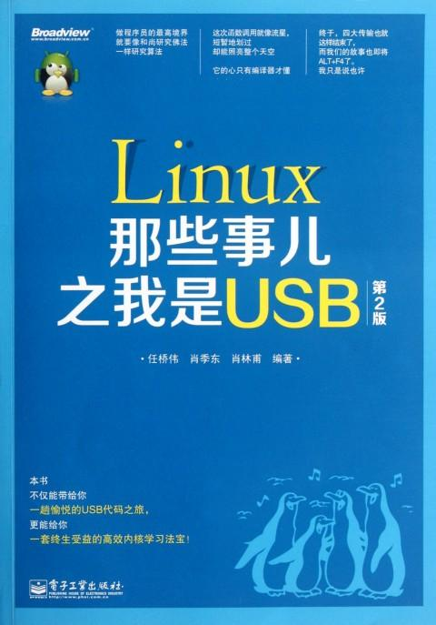
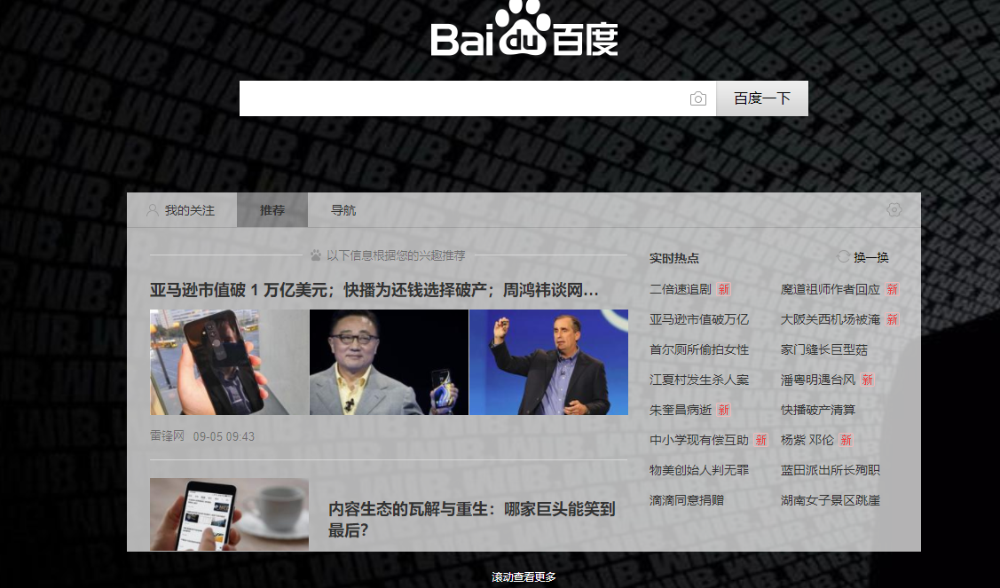

# Linux那些事儿

## 本仓库内容

* linux2.6.22USB源码
* Linux内核基本原理

```
Something I hope you know before go into the coding~
First, please watch or star this repo, I'll be more happy if you follow me.
Bug report, questions and discussion are welcome, you can post an issue or pull a request.
```

## 相关站点

* GitBook访问地址:<https://yifengyou.gitbooks.io/linux-2-4-0/content/>
* GitHub访问地址:<https://github.com/yifengyou/linux-2.4.0/>


## 目录


* [Linux那些事儿之我是Block层](docs/Linux那些事儿之我是Block层.md)
* [Linux那些事儿之我是EHCI主机控制器](docs/Linux那些事儿之我是EHCI主机控制器.md)
* [Linux那些事儿之我是HUB](docs/Linux那些事儿之我是HUB.md)
* [Linux那些事儿之我是PCI](docs/Linux那些事儿之我是PCI.md)
* [Linux那些事儿之我是SCSI硬盘](docs/Linux那些事儿之我是SCSI硬盘.md)
* [Linux那些事儿之我是Sysfs](docs/Linux那些事儿之我是Sysfs.md)
* [Linux那些事儿之我是UHCI](docs/Linux那些事儿之我是UHCI.md)
* [Linux那些事儿之我是USBCore](docs/Linux那些事儿之我是USBCore.md)
* [Linux那些事儿之我是U盘](docs/Linux那些事儿之我是U盘.md)

## 参考书籍



《Linux那些事儿之我是USB(第2版)》基于2.6.22内核，对USB子系统的大部分源代码逐行进行分析，系统地阐释了Linux内核中USB于系统是如何运转的，子系统内部的各个模块之间是如何互相协作、配合的。本次改版修改了第1版中出现的错误，增加了一个附录，主要内容是关于Linux内核的学习方法，是作者的经验总结，值得一读。

《Linux那些事儿之我是USB(第2版)》使用幽默诙谐的笔调对Linux内核中的USB子系统源代码进行了分析，形象且详尽地介绍了USB在Linux中的实现。《Linux那些事儿之我是USB(第2版)》从U盘、Hub、USB Core到主机控制器覆盖了USB实现的方方面面，被一些网友誉为**USB开发的“圣经”**。

* 对于Linux初学者，可以通过《Linux那些事儿之我是USB(第2版)》掌握学习内核、浏览内核代码的方法；
* 对于Linux驱动开发者，可以通过《Linux那些事儿之我是USB(第2版)》对设备模型有形象深刻的理解；
* 对于USB开发者，可以通过《Linux那些事儿之我是USB(第2版)》全面理解USB在一个操作系统中的实现；
* 对于Linux内核开发者，也可以通过《Linux那些事儿之我是USB(第2版)》学习到很多Linux高手开发和维护一个完整子系统时的编程思想。

## 参考博客


<https://blog.csdn.net/fudan_abc/article/list/15>

由复旦fudan_abc写的，风趣的文笔，深入浅出地讲解了Linux内核相关模块，主要涉及了USB相关的模块，但是同样也解析了Linux驱动模型相关的知识，很值得一读。

## 总结

```
  1.基础永远值得花费90%的精力去学习加强。厚积而薄发~
  2.要理解一个软件系统的真正运行机制，一定要阅读其源代码~
```


