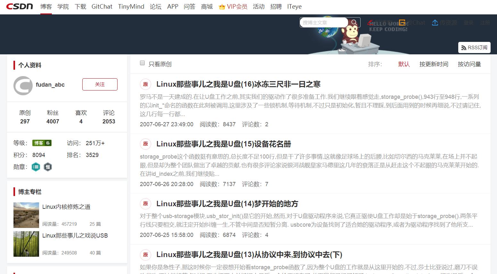

# Linux那些事儿

* GitBook访问地址:<https://yifengyou.gitbooks.io/linux-2-4-0/content/>
* GitHub访问地址:<https://github.com/yifengyou/linux-2.4.0/>

```
Something I hope you know before go into the coding~
First, please watch or star this repo, I'll be more happy if you follow me.
Bug report, questions and discussion are welcome, you can post an issue or pull a request.
```

## 目录

## 参考博客




<https://blog.csdn.net/fudan_abc/article/list/15>

由复旦fudan_abc写的，风趣的文笔，深入浅出地讲解了Linux内核相关模块，主要涉及了USB相关的模块，但是同样也解析了Linux驱动模型相关的知识，很值得一读。

## 总结

```
  1.基础永远值得花费90%的精力去学习加强。厚积而薄发~
  2.要理解一个软件系统的真正运行机制，一定要阅读其源代码~
```
