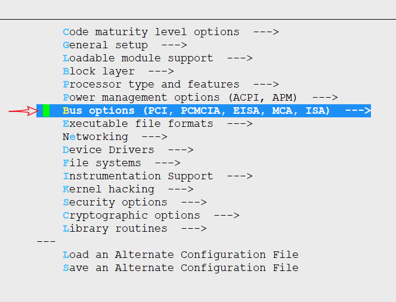
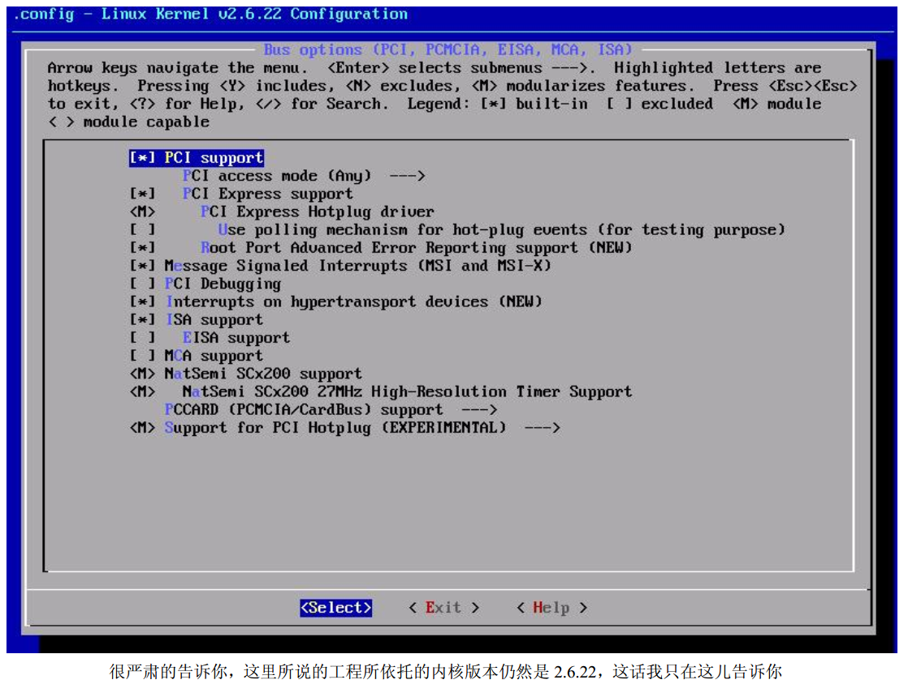

# Linux那些事儿之我是PCI

* make menuconfig就可以看到关于Bus Options的配置选项,子选项包含PCI配置，只有打开PCI support才能进入 PCI access mode(Any)子选项
* 第二项“PCI access mode”的存在，它是一个单项选择题，有四个答案， 分别是 BIOS、 MMConfig、 Direct、 Any
  * Any 选项本身就表示了你告 诉内核说前面三个答案随便一个都可以，你只要选上了它，就相当于所有的四个答案都给选上了

##
